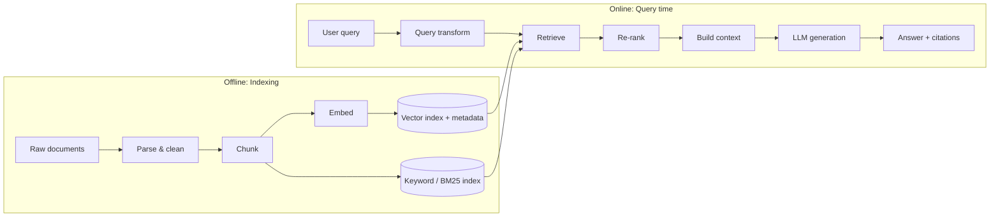

<div align="center">

# 🔎 RAG 101

**A practical, from-first-principles guide to Retrieval-Augmented Generation, from naive pipelines to production-grade systems.**

[](LICENSE)
[](CONTRIBUTING.md)
[](https://www.python.org/)
[](https://github.com/your-username/rag-101)

[What is RAG?](#-what-is-rag) • [Architecture](#-architecture) • [Quickstart](#-quickstart) • [Deep Dives](#-deep-dives) • [Evaluation](#-evaluation) • [Failure Modes](#-failure-modes--debugging) • [Interview Questions](#-interview-questions) • [Papers](#-papers)

</div> 
 
---

## 📖 About

RAG looks simple in a tutorial: embed some documents, retrieve the top-k, paste them into a prompt. In practice, most of the quality (and most of the bugs) live in the details: chunking, retrieval quality, ranking, context construction, and evaluation.

This repo teaches RAG in layers:

1. **Understand** the core idea and why it works
2. **Build** a working pipeline from scratch
3. **Improve** it with hybrid search, re-ranking, and query transformations
4. **Measure** it with retrieval and generation metrics
5. **Debug** it systematically when it fails

**Who it's for:** engineers new to RAG, researchers who want a practical grounding, and anyone preparing for applied LLM interviews.

**Prerequisites:** Python, basic familiarity with embeddings and LLM APIs.

---

## 🧭 What is RAG?

A language model's knowledge is frozen at training time, is stored implicitly in its weights, and can't be cited or updated cheaply. **Retrieval-Augmented Generation** addresses this by fetching relevant external documents at query time and supplying them to the model as context.

| Approach | Best for | Limitations |
|---|---|---|
| **Prompting alone** | General knowledge, formatting, reasoning | Stale facts, hallucination, no private data |
| **RAG** | Private/fresh/large corpora, attributable answers | Retrieval quality caps answer quality; added latency and infra |
| **Fine-tuning** | Style, format, domain behavior, task specialization | Poor for injecting frequently changing facts; needs data and training |
| **Long context** | Small corpora that fit in the window | Cost, latency, and degraded use of information buried mid-context |

**Rule of thumb:** use RAG for *knowledge*, fine-tuning for *behavior*, and combine them when you need both.

**When RAG is the wrong tool:** questions requiring aggregation over the whole corpus ("summarize every complaint this year"), tasks better solved with structured queries (SQL), or corpora small enough to fit directly in context.

---

## 🏗 Architecture



**The two phases**

- **Indexing (offline):** parse → chunk → embed → store, with metadata (source, section, date, permissions)
- **Querying (online):** transform query → retrieve candidates → re-rank → assemble prompt → generate → cite

---

## ⚡ Quickstart

```bash
git clone https://github.com/your-username/rag-101.git
cd rag-101
python -m venv .venv && source .venv/bin/activate   # Windows: .venv\Scripts\activate
pip install -r requirements.txt
cp .env.example .env                                # add your LLM API key
jupyter lab notebooks/01_naive_rag.ipynb
```

### A minimal RAG pipeline (~40 lines)

```python
import numpy as np
import faiss
from sentence_transformers import SentenceTransformer

# ---------- 1. Chunk ----------
def chunk_text(text: str, size: int = 200, overlap: int = 40) -> list[str]:
    words = text.split()
    step = size - overlap
    return [" ".join(words[i:i + size]) for i in range(0, len(words), step)]

documents = ["...your documents here..."]
chunks = [c for doc in documents for c in chunk_text(doc)]

# ---------- 2. Embed & index ----------
embedder = SentenceTransformer("BAAI/bge-small-en-v1.5")
embeddings = embedder.encode(chunks, normalize_embeddings=True).astype("float32")

index = faiss.IndexFlatIP(embeddings.shape[1])   # inner product == cosine on normalized vectors
index.add(embeddings)

# ---------- 3. Retrieve ----------
def retrieve(query: str, k: int = 5) -> list[tuple[str, float]]:
    q = embedder.encode([query], normalize_embeddings=True).astype("float32")
    scores, ids = index.search(q, k)
    return [(chunks[i], float(s)) for i, s in zip(ids[0], scores[0]) if i != -1]

# ---------- 4. Generate ----------
def build_prompt(query: str, hits: list[tuple[str, float]]) -> str:
    context = "\n\n".join(f"[{i+1}] {text}" for i, (text, _) in enumerate(hits))
    return (
        "Answer the question using ONLY the context below. "
        "Cite sources like [1]. If the context is insufficient, say so.\n\n"
        f"Context:\n{context}\n\nQuestion: {query}\nAnswer:"
    )

def answer(query: str) -> str:
    prompt = build_prompt(query, retrieve(query))
    return call_llm(prompt)   # plug in your LLM client of choice
```

> ⚠️ Some embedding models expect a task prefix on queries (for example, BGE recommends an instruction prefix for retrieval queries). Always check the model card, since mismatched prefixes quietly hurt recall.

---

## 🗺 Learning Path

| Level | Topic | Notebook |
|---|---|---|
| 🟢 **1: Naive RAG** | Chunk → embed → retrieve → generate | [`01_naive_rag.ipynb`](notebooks/01_naive_rag.ipynb) |
| 🟢 **1** | Chunking strategies compared | [`02_chunking.ipynb`](notebooks/02_chunking.ipynb) |
| 🟡 **2: Better retrieval** | Hybrid search (BM25 + dense) with RRF | [`03_hybrid_search.ipynb`](notebooks/03_hybrid_search.ipynb) |
| 🟡 **2** | Cross-encoder re-ranking | [`04_reranking.ipynb`](notebooks/04_reranking.ipynb) |
| 🟡 **2** | Query rewriting, HyDE, multi-query | [`05_query_transformations.ipynb`](notebooks/05_query_transformations.ipynb) |
| 🟡 **3: Measure** | Retrieval + generation evaluation | [`06_evaluation.ipynb`](notebooks/06_evaluation.ipynb) |
| 🔴 **4: Advanced** | Agentic RAG, GraphRAG, self-reflection | [`07_advanced_patterns.ipynb`](notebooks/07_advanced_patterns.ipynb) |
| 🔴 **4** | Production concerns: caching, latency, security | [`08_production.md`](docs/08_production.md) |

---

## 🔬 Deep Dives

### 1. Parsing & Cleaning
Garbage in, garbage out. Most "retrieval problems" are actually parsing problems.
- Preserve structure: headings, tables, lists, code blocks
- Handle PDFs carefully (multi-column layouts, headers/footers, scanned pages → OCR)
- Strip boilerplate (navigation, cookie banners, repeated footers)
- Keep provenance: source, page, section, timestamp

### 2. Chunking
Chunking decides what the retriever can even *find*.

| Strategy | How it works | Trade-off |
|---|---|---|
| **Fixed-size** | Split every N tokens with overlap | Simple and fast, but cuts across ideas |
| **Recursive** | Split on paragraph → sentence → word boundaries | Good default; respects natural structure |
| **Structure-aware** | Split by headings/sections/functions | Best for docs, code, legal; needs a parser |
| **Semantic** | Split where embedding similarity drops | Coherent chunks; costlier and less predictable |
| **Parent–child** | Retrieve small chunks, return the larger parent | Precise matching with fuller context |
| **Contextual chunks** | Prepend a short document-level summary to each chunk | Fixes "orphaned" chunks; adds indexing cost |

**Guidelines:** start with recursive splitting around 200–500 tokens with 10–20% overlap, then *tune against your eval set*, not intuition. Small chunks favor precision; large chunks favor context.

### 3. Embeddings
- **Bi-encoders** encode query and document independently, so document vectors can be precomputed (fast, approximate)
- Choose models using **[MTEB](https://huggingface.co/spaces/mteb/leaderboard)** as a starting point, but always validate on *your* data and language
- Watch: max sequence length, embedding dimension (storage/latency), query vs. document prefixes, multilingual needs
- Normalize vectors when using cosine similarity or inner product
- Consider **domain adaptation** (fine-tuning embeddings on in-domain query–passage pairs) when off-the-shelf recall is poor

### 4. Indexing & Vector Search
| Index | Idea | Notes |
|---|---|---|
| **Flat** | Exact brute-force search | Perfect recall; fine up to ~100K–1M vectors |
| **HNSW** | Navigable small-world graph | High recall/speed; higher memory |
| **IVF** | Cluster vectors, search nearest clusters | Tunable via `nprobe`; needs training |
| **PQ / OPQ** | Compress vectors via quantization | Big memory savings; some recall loss |

Always store **metadata** alongside vectors to enable filtering (tenant, date range, document type, access permissions). Filtering *before or during* search is usually better than filtering after, which can return too few results.

### 5. Hybrid Search
Dense retrieval captures semantics but can miss exact terms (IDs, error codes, names). Sparse retrieval (BM25) is strong on exact matches. Combine them.

**Reciprocal Rank Fusion (RRF)** merges ranked lists without needing comparable scores:

```
RRF(d) = Σ_i  1 / (k + rank_i(d))        # commonly k = 60
```

```python
def rrf(rankings: list[list[str]], k: int = 60) -> list[str]:
    scores: dict[str, float] = {}
    for ranking in rankings:
        for rank, doc_id in enumerate(ranking, start=1):
            scores[doc_id] = scores.get(doc_id, 0.0) + 1.0 / (k + rank)
    return sorted(scores, key=scores.get, reverse=True)
```

### 6. Re-ranking
Two-stage retrieval: a fast retriever fetches ~50–100 candidates, then a slower, more accurate **cross-encoder** scores each (query, passage) pair jointly and keeps the top few.

- Cross-encoders are more accurate than bi-encoders but can't be precomputed
- Late-interaction models (e.g., ColBERT-style) offer a middle ground
- Typical gain: significant improvements in precision@k for a modest latency cost

### 7. Query Transformations
| Technique | What it does | When it helps |
|---|---|---|
| **Query rewriting** | Clarifies/expands the user's question | Vague or conversational queries |
| **Multi-query** | Generates several paraphrases, fuses results | Recall-critical tasks |
| **HyDE** | Generates a hypothetical answer, embeds *that* | Short queries vs. long documents |
| **Decomposition** | Splits complex questions into sub-questions | Multi-hop questions |
| **Step-back** | Asks a more general question first | Questions needing background context |
| **Conversation condensation** | Rewrites follow-ups as standalone queries | Multi-turn chat |

### 8. Context Construction
- Retrieval quality is not the end: **how you pack the context** matters
- Models tend to use information at the start and end of long contexts better than the middle ("lost in the middle"), so order and trim deliberately
- Deduplicate near-identical chunks; enforce a token budget
- Include source identifiers so the model can cite
- Instruct the model to abstain when the context doesn't contain the answer

### 9. Generation & Grounding
- Instruct explicitly: use only the provided context, cite sources, and say "I don't know" when unsupported
- Verify citations programmatically where possible (does the cited chunk actually support the claim?)
- For high-stakes domains, add a groundedness check or verifier pass before returning the answer

---

## 📊 Evaluation

You can't improve what you don't measure. **Evaluate retrieval and generation separately** so you know which component is failing.

### Build an eval set first
- 50–200 representative questions is a strong start
- For each: the question, ground-truth relevant passages/documents, and (optionally) a reference answer
- Include hard cases: multi-hop, ambiguous, unanswerable, and exact-match queries
- Synthetic question generation can bootstrap a set, but **have humans review it** and refresh it from real traffic

### Retrieval metrics
| Metric | Question it answers |
|---|---|
| **Recall@k** | Did the relevant passage appear in the top-k? |
| **Precision@k** | What fraction of the top-k is relevant? |
| **MRR** | How high is the *first* relevant result? |
| **nDCG@k** | How good is the full ranking, accounting for graded relevance? |

```python
def recall_at_k(retrieved: list[str], relevant: set[str], k: int) -> float:
    return len(set(retrieved[:k]) & relevant) / max(len(relevant), 1)

def mrr(retrieved: list[str], relevant: set[str]) -> float:
    for rank, doc_id in enumerate(retrieved, start=1):
        if doc_id in relevant:
            return 1.0 / rank
    return 0.0
```

### Generation metrics
| Metric | Meaning |
|---|---|
| **Faithfulness / groundedness** | Is every claim supported by the retrieved context? |
| **Answer relevance** | Does the answer actually address the question? |
| **Context precision / recall** | Was the retrieved context useful and sufficient? |
| **Correctness** | Does the answer match the reference? |
| **Abstention quality** | Does it decline when it should, and answer when it can? |

**LLM-as-judge** is a practical way to score these at scale, but calibrate it against human labels; judges have position, verbosity, and self-preference biases.

### Online signals
Thumbs up/down, citation click-through, reformulation rate, escalation-to-human rate, and latency/cost per query.

---

## 🩺 Failure Modes & Debugging

When an answer is wrong, walk the pipeline in order:

```
1. Was the answer in the corpus at all?          → Ingestion / coverage problem
2. Was it parsed and chunked intact?             → Parsing / chunking problem
3. Was it retrieved in the top-k?                → Retrieval problem
4. Was it ranked high enough to make the prompt? → Re-ranking / k / budget problem
5. Was it presented clearly in the context?      → Context construction problem
6. Did the model use it faithfully?              → Generation / prompting problem
```

| Symptom | Likely causes | Fixes |
|---|---|---|
| Relevant doc never retrieved | Bad chunking, weak embeddings, vocabulary mismatch | Tune chunking, hybrid search, domain-adapt embeddings, query rewriting |
| Right doc retrieved, wrong answer | Buried in context, too much noise, weak prompt | Re-rank, reduce k, reorder, tighten instructions |
| Confident hallucination | No abstention instruction, irrelevant context | Add "answer only from context", groundedness check, relevance threshold |
| Misses exact IDs / names / codes | Dense-only retrieval | Add BM25 / hybrid |
| Fails on multi-hop questions | Single retrieval round | Decomposition, iterative / agentic retrieval |
| Fragments lack meaning | Chunks stripped of context | Parent–child, contextual chunks, include headings |
| Outdated answers | Stale index | Incremental re-indexing, freshness metadata, TTLs |
| Leaks restricted content | Access control applied after retrieval | Enforce permissions in the retrieval filter |
| Injected instructions in documents | Untrusted content treated as instructions | Treat retrieved text as data, sanitize, isolate, and monitor |
| Slow / expensive | Large k, big re-ranker, long prompts | Cache, smaller re-rank pool, prompt trimming, tiered models |

---

## 🚀 Beyond Naive RAG

- **Agentic RAG:** the model decides *when* and *what* to retrieve, can issue multiple searches, and can call other tools
- **Self-reflective RAG:** critiques retrieved passages and its own draft, and re-retrieves when needed (e.g., Self-RAG, Corrective RAG)
- **Graph-based RAG:** builds a knowledge graph or hierarchical summaries to answer corpus-level, multi-hop questions
- **Multimodal RAG:** retrieval over images, tables, charts, and page layouts
- **Fine-tuned retrievers & rerankers:** adapt to your domain with hard-negative mining
- **Caching:** semantic and prompt caching to cut latency and cost

> **Start simple.** Add each technique only when your evals show a specific failure it fixes.

---

## 🏭 Production Checklist

- [ ] Eval set + automated regression tests run on every change
- [ ] Incremental indexing, with deletions and updates handled correctly
- [ ] Metadata filters and **access control enforced at retrieval time**
- [ ] Observability: log query, retrieved chunks, scores, prompt, answer, latency, cost
- [ ] Latency budget per stage (retrieval, re-rank, generation)
- [ ] Caching and rate limiting
- [ ] Prompt-injection and data-exfiltration defenses
- [ ] PII handling and data-retention policy
- [ ] Graceful fallbacks (no results, timeouts, low confidence)
- [ ] Feedback loop from real users into the eval set

---

## 🎤 Interview Questions

<details>
<summary><b>🟢 Fundamentals</b></summary>

- What problem does RAG solve, and when would you choose it over fine-tuning?
- Walk through the components of a basic RAG pipeline.
- What are the trade-offs of small vs. large chunk sizes?
- What's the difference between a bi-encoder and a cross-encoder?

</details>

<details>
<summary><b>🟡 Applied</b></summary>

- Your RAG system answers fluently but incorrectly. How do you debug it?
- Why might dense retrieval miss an exact product code, and how would you fix it?
- Explain Reciprocal Rank Fusion and why it's used for hybrid search.
- How would you evaluate a RAG system without labeled data?
- How do you handle multi-turn conversations in RAG?
- How would you enforce per-user document permissions?

</details>

<details>
<summary><b>🔴 Advanced</b></summary>

- Design RAG over 50M documents with strict latency and freshness requirements.
- How would you handle multi-hop questions that need evidence from several documents?
- How would you fine-tune an embedding model for a specialized domain, and how would you mine hard negatives?
- Your recall@10 is high but answer quality is poor. What could explain this?
- What are the security risks of RAG, and how would you mitigate indirect prompt injection?
- When would you choose long-context prompting over RAG, or combine them?

</details>

---

## 📄 Papers

| Paper | Why it matters |
|---|---|
| *Retrieval-Augmented Generation for Knowledge-Intensive NLP Tasks* (Lewis et al., 2020) | Introduced the RAG formulation |
| *Dense Passage Retrieval for Open-Domain QA* (Karpukhin et al., 2020) | Established dense bi-encoder retrieval |
| *REALM* (Guu et al., 2020) | Retrieval-augmented pretraining |
| *ColBERT* (Khattab & Zaharia, 2020) | Late-interaction retrieval |
| *BEIR* (Thakur et al., 2021) | Zero-shot retrieval benchmark; dense vs. sparse generalization |
| *Precise Zero-Shot Dense Retrieval without Relevance Labels* (HyDE, Gao et al., 2022) | Hypothetical-document query expansion |
| *Lost in the Middle* (Liu et al., 2023) | How position affects context usage |
| *Self-RAG* (Asai et al., 2023) | Adaptive retrieval with self-critique |
| *Corrective RAG* (Yan et al., 2024) | Evaluating and correcting retrieval |
| *RAPTOR* (Sarthi et al., 2024) | Recursive tree-structured summarization for retrieval |
| *From Local to Global: A Graph RAG Approach* (Edge et al., 2024) | Graph-based RAG for corpus-level questions |
| *RAGAS* (Es et al., 2023) | Reference-free RAG evaluation |

---

## 🧰 Tooling Landscape

| Layer | Options (illustrative, not exhaustive) |
|---|---|
| **Parsing** | Unstructured, Docling, PyMuPDF, Apache Tika |
| **Embeddings** | sentence-transformers, BGE, E5, GTE, hosted embedding APIs |
| **Vector stores** | FAISS, pgvector, Qdrant, Weaviate, Milvus, Chroma, Elasticsearch/OpenSearch |
| **Sparse search** | BM25 (Elasticsearch/OpenSearch, Tantivy, `rank-bm25`) |
| **Re-rankers** | Cross-encoders (sentence-transformers), hosted rerank APIs |
| **Orchestration** | LlamaIndex, LangChain, Haystack, or plain Python |
| **Evaluation** | RAGAS, TruLens, DeepEval, custom harnesses |

> **Advice:** build your first pipeline in plain Python so you understand every moving part before adopting a framework.

---

## 📁 Repository Structure

```
rag-101/
├── README.md
├── requirements.txt
├── .env.example
├── notebooks/
│   ├── 01_naive_rag.ipynb
│   ├── 02_chunking.ipynb
│   ├── 03_hybrid_search.ipynb
│   ├── 04_reranking.ipynb
│   ├── 05_query_transformations.ipynb
│   ├── 06_evaluation.ipynb
│   └── 07_advanced_patterns.ipynb
├── src/
│   ├── chunking.py
│   ├── embeddings.py
│   ├── retrieval.py
│   ├── rerank.py
│   ├── generate.py
│   └── evaluate.py
├── data/
│   ├── sample_docs/
│   └── eval_set.jsonl
├── docs/
│   ├── 08_production.md
│   └── glossary.md
└── tests/
```

---

## 📚 Further Reading

- Chip Huyen: *AI Engineering* (chapters on RAG and evaluation)
- Lilian Weng's blog on LLM-powered agents and retrieval
- Pinecone, Weaviate, and Qdrant learning centers for vector-search fundamentals
- Hugging Face **MTEB** leaderboard and the **BEIR** benchmark for retrieval evaluation

---

## 🤝 Contributing

Contributions are welcome: bug fixes, new notebooks, better explanations, additional evaluation datasets, or new failure-mode case studies.

1. Fork the repo and create a branch
2. Make your changes (keep notebooks reproducible and outputs cleared)
3. Open a pull request describing *what* changed and *why*

See [CONTRIBUTING.md](CONTRIBUTING.md) for details.

---

## 📜 License

Distributed under the MIT License. See [`LICENSE`](LICENSE) for details.

---

<div align="center">

**If this helped you build or debug a RAG system, please give it a ⭐**

</div>
